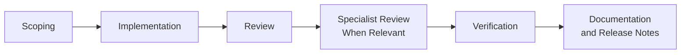
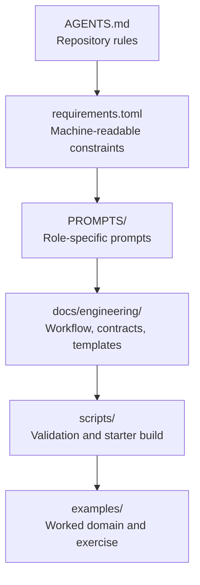

# Agent Workflow Blueprint

Agent workflow for enterprise software breaks down when prompts are treated as the whole system.
Reliable agent work needs stricter inputs than that: repository rules, explicit handoff artifacts, specialist review gates, and verification that fails when the repository drifts away from what it claims to enforce.

This repository is a general-purpose blueprint for that approach.

## What This Repository Is

This is a workflow and governance bundle for teams using agents on production software.
It is designed to make scope drift, fake confidence, and release dishonesty harder to get past review.

It includes:

- repository operating rules in `AGENTS.md`
- machine-readable workflow constraints in `requirements.toml`
- role-specific prompts for scoping, implementation, review, accessibility review, security review, and release verification
- a seven-gate prompt pack under `PROMPTS/master-prompt.md` covering implementation, anti-fake completion, UI/A11Y audit, feature health, pre-mortem, and release proof
- packet templates for handoffs and evidence
- workflow validation scripts
- a worked example domain and a canonical exercise
- an integrated template library at `examples/template-libraries/agent-templates-production/` with 100 extracted prompt/skill/contract files

It does not include a runnable application.
The current verification commands prove the workflow bundle and starter artifact only.
They do not prove a deployed product.

## GitHub Pages Site

A static GitHub Pages landing page lives in `index.html` and `site.css`.
It links directly to the real prompts, contracts, templates, examples, and verification scripts in this repository instead of duplicating them into marketing-only copies.
Publish it with `.nojekyll` so GitHub Pages serves dot-prefixed repository assets such as `.codex/skills/strict-agent-workflow/SKILL.md`.
The site is a documentation surface for the workflow bundle.
It is not a verified product build.

## Workflow

The core operating sequence is intentionally strict:



That flow is backed by:

- [AGENTS.md](AGENTS.md)
- [docs/engineering/workflow.md](docs/engineering/workflow.md)
- [docs/engineering/templates/scoping-packet-template.md](docs/engineering/templates/scoping-packet-template.md)
- [docs/engineering/templates/review-packet-template.md](docs/engineering/templates/review-packet-template.md)
- [docs/engineering/templates/accessibility-review-template.md](docs/engineering/templates/accessibility-review-template.md)
- [docs/engineering/templates/security-review-template.md](docs/engineering/templates/security-review-template.md)
- [docs/engineering/templates/release-evidence-template.md](docs/engineering/templates/release-evidence-template.md)

## Repository Shape



## Why The Structure Is Split

One large agent prompt is not enough for enterprise work.
The repo separates concerns because the failure modes are different:

- scoping exists to bound uncertainty and name risks before code changes start
- implementation exists to make the smallest correct change
- review exists to reject scope drift, behavioural regressions, and documentation lies
- accessibility review exists to separate deterministic evidence from human judgement
- security review exists to keep trust boundaries, authorization, secrets, exports, and logging honest
- release verification exists to stop public claims drifting beyond verified behaviour

That separation matches current official guidance around explicit instructions, reusable workflows, and specialized agent roles.[^openai-prompt][^codex-workflows][^codex-subagents]

## Verification

The repository currently validates:

- prompt structure and prompt-to-template linkage
- required workflow and template files
- example and exercise presence
- unsupported-claim checks in key docs
- starter bundle generation to `dist/starter-manifest.json`

The repository currently does not validate:

- a live web application
- a production dashboard backend
- real export behaviour
- real authentication or authorization flows

Run the current verification bundle with:

```bash
bash scripts/verify-release.sh
```

## Start Here

For real repository use, the shortest correct reading order is:

1. [AGENTS.md](AGENTS.md)
2. [requirements.toml](requirements.toml)
3. [docs/engineering/workflow.md](docs/engineering/workflow.md)
4. contract files under [docs/engineering/contracts](docs/engineering/contracts)
5. role prompts under [PROMPTS](PROMPTS)
6. packet templates under [docs/engineering/templates](docs/engineering/templates)
7. worked example and exercise under [examples](examples)

## References

This repository structure and wording were informed by current primary documentation:

- OpenAI Codex overview: [developers.openai.com/codex](https://developers.openai.com/codex)
- OpenAI Codex config basics: [developers.openai.com/codex/config-basic](https://developers.openai.com/codex/config-basic)
- OpenAI Codex advanced configuration: [developers.openai.com/codex/config-advanced](https://developers.openai.com/codex/config-advanced)
- OpenAI Codex skills: [developers.openai.com/codex/skills](https://developers.openai.com/codex/skills)
- OpenAI Codex workflows: [developers.openai.com/codex/workflows](https://developers.openai.com/codex/workflows)
- OpenAI Codex subagents: [developers.openai.com/codex/subagents](https://developers.openai.com/codex/subagents)
- OpenAI prompt engineering guide: [developers.openai.com/api/docs/guides/prompt-engineering](https://developers.openai.com/api/docs/guides/prompt-engineering)
- OpenAI prompt guidance: [developers.openai.com/api/docs/guides/prompt-guidance](https://developers.openai.com/api/docs/guides/prompt-guidance)
- OpenAI evals guide: [platform.openai.com/docs/guides/evals](https://platform.openai.com/docs/guides/evals)
- Playwright accessibility testing: [playwright.dev/docs/accessibility-testing](https://playwright.dev/docs/accessibility-testing)
- Playwright locators: [playwright.dev/docs/locators](https://playwright.dev/docs/locators)
- Playwright ARIA snapshots: [playwright.dev/docs/aria-snapshots](https://playwright.dev/docs/aria-snapshots)
- GitHub Copilot code review guidance: [docs.github.com/copilot/using-github-copilot/code-review/using-copilot-code-review](https://docs.github.com/copilot/using-github-copilot/code-review/using-copilot-code-review)

[^openai-prompt]: OpenAI emphasizes clearer instructions and output expectations for more reliable behavior.
[^codex-workflows]: Codex documentation explicitly supports reusable workflows rather than one-off prompting.
[^codex-subagents]: Codex documentation supports specialized multi-step agent flows.
