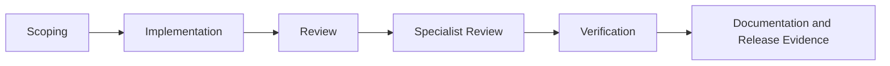

# Agent Workflow Blueprint

Agent work fails when teams treat one impressive prompt as the whole system. Reliable agent work needs repository rules, specialist prompts, evidence contracts, repeatable skills, review packets, and verification that catches drift.

This repository is a professional agent-governance blueprint for teams that want coding agents to produce auditable work instead of confident theatre.

## What this repository contains

- `AGENTS.md` — repository-wide operating rules for coding agents.
- `requirements.toml` — machine-readable task, review, accessibility, release, and starter constraints.
- `PROMPTS/` — core workflow prompts for scoping, implementation, review, accessibility, security, and release.
- `docs/engineering/contracts/` — engineering contracts for architecture, testing, accessibility, security, and release truthfulness.
- `docs/engineering/templates/` — packet templates for scoping, review, specialist review, and release evidence.
- `docs/template-library/` — 100 copy-ready prompts, skills, and contracts.
- `examples/` — a worked teaching scenario and review-packet examples.
- `scripts/` — validation checks that protect the workflow bundle from claim drift.
- `index.html` and `site.css` — a static GitHub Pages template hub.

It does not include a runnable application. The current verification commands prove the workflow bundle and starter artefact only. They do not prove a deployed product.

## Template library

The professional template library lives in [`docs/template-library`](docs/template-library).

It contains:

- **40 prompts** for agent control, implementation, review, UI, accessibility, testing, security, documentation, and release evidence.
- **30 skills** for repeatable specialist procedures.
- **30 contracts** for acceptance criteria, rejection wording, and evidence gates.

Start here:

- [`docs/template-library/START-HERE.md`](docs/template-library/START-HERE.md)
- [`docs/template-library/STARTER-PACKS.md`](docs/template-library/STARTER-PACKS.md)
- [`docs/template-library/CATALOGUE.md`](docs/template-library/CATALOGUE.md)
- [`docs/template-library/QUALITY-RUBRIC.md`](docs/template-library/QUALITY-RUBRIC.md)
- [`docs/template-library/CODEX-USAGE-GUIDE.md`](docs/template-library/CODEX-USAGE-GUIDE.md)
- [`docs/template-library/RESEARCH-BASIS.md`](docs/template-library/RESEARCH-BASIS.md)
- [`DELIVERY-NOTES.md`](DELIVERY-NOTES.md)

## How to use it with Codex

1. Give Codex the task.
2. Require Codex to read `AGENTS.md`, `requirements.toml`, and `docs/engineering/workflow.md`.
3. Select one prompt from `docs/template-library/prompts/`.
4. Add one skill from `docs/template-library/skills/` when repeatable execution is needed.
5. Add one contract from `docs/template-library/contracts/` when acceptance or rejection must be enforceable.
6. Require exact command results and one final status: `verified`, `partially verified`, `not verified`, or `blocked`.

Example:

```text
Use AGENTS.md and docs/engineering/workflow.md.
Then use docs/template-library/prompts/12-bug-root-cause-remediation-prompt.md,
docs/template-library/skills/12-regression-test-design-skill.md, and
docs/template-library/contracts/06-test-behaviour-contract.md.
Do not claim the bug is fixed unless the failure path is proven and verification results are reported.
```

## Workflow



That flow is backed by:

- [AGENTS.md](AGENTS.md)
- [docs/engineering/workflow.md](docs/engineering/workflow.md)
- [docs/engineering/templates/scoping-packet-template.md](docs/engineering/templates/scoping-packet-template.md)
- [docs/engineering/templates/review-packet-template.md](docs/engineering/templates/review-packet-template.md)
- [docs/engineering/templates/accessibility-review-template.md](docs/engineering/templates/accessibility-review-template.md)
- [docs/engineering/templates/security-review-template.md](docs/engineering/templates/security-review-template.md)
- [docs/engineering/templates/release-evidence-template.md](docs/engineering/templates/release-evidence-template.md)

## Verification

Run the full release verification bundle:

```bash
npm run verify:release
```

Or run individual checks:

```bash
python3 -S scripts/check_prompts.py
python3 -S scripts/check_workflow.py
python3 -S scripts/check_examples.py
python3 -S scripts/check_claims.py
python3 -S scripts/check_template_library.py
python3 -S scripts/build_starter.py
```

## What the checks prove

The checks prove:

- required prompts, contracts, templates, and examples exist
- core prompt files contain required sections
- workflow references stay connected
- unsupported starter claims are blocked in key public files
- the 100-asset template library has the required count, sections, metadata, and minimum enforcement depth
- `dist/starter-manifest.json` can be generated

The checks do not prove:

- live UI behaviour
- product deployment
- application authentication or authorization
- runtime accessibility behaviour
- security posture of a real app
- performance of a real app

## Public site

The GitHub Pages site in `index.html` exposes the repository as a template hub with categories, starter packs, direct markdown links, and copy actions powered by `docs/template-library/assets.json`.

Keep `.nojekyll` in the repository so GitHub Pages serves repository files without Jekyll processing.

## References

The repository is informed by current primary documentation and standards listed in [`docs/template-library/RESEARCH-BASIS.md`](docs/template-library/RESEARCH-BASIS.md).
